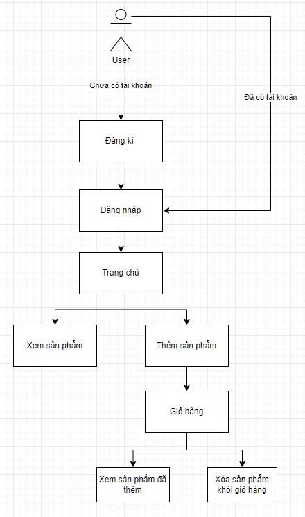
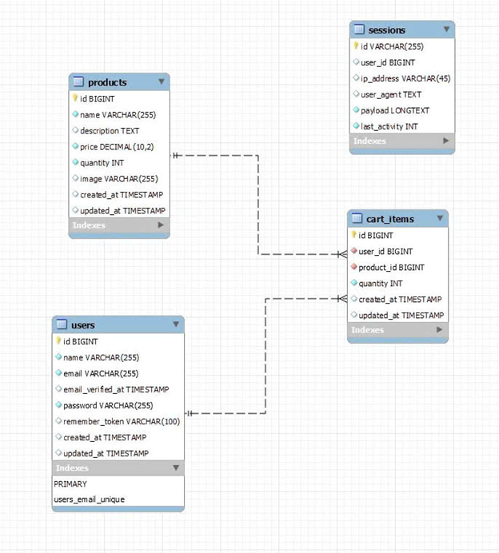

# E-Commerce Website

## Giới thiệu
Đây là một trang web bán hàng trực tuyến được xây dựng bằng Laravel. Hệ thống cho phép người dùng đăng ký, đăng nhập, thêm sản phẩm vào giỏ hàng và xóa sản phẩm khỏi giỏ hàng.

## Chức năng chính
- Đăng ký và đăng nhập người dùng.
- Hiển thị danh sách sản phẩm.
- Thêm sản phẩm vào giỏ hàng.
- Xóa sản phẩm khỏi giỏ hàng.
- Quản lý phiên đăng nhập của người dùng.

## Luồng hoạt động của hệ thống
Hệ thống hoạt động theo sơ đồ sau:

1. Người dùng có thể đăng ký nếu chưa có tài khoản.
2. Sau khi đăng ký, người dùng đăng nhập vào hệ thống.
3. Tại trang chủ, người dùng có thể:
   - Xem danh sách sản phẩm.
   - Thêm sản phẩm vào giỏ hàng.
4. Trong giỏ hàng, người dùng có thể:
   - Xem danh sách sản phẩm đã thêm.
   - Xóa sản phẩm khỏi giỏ hàng.



## Cấu trúc cơ sở dữ liệu
Hệ thống sử dụng các bảng chính sau:

### Bảng `users`
- Lưu thông tin tài khoản người dùng.
- Trường chính: `id`, `name`, `email`, `password`, `created_at`, `updated_at`.

### Bảng `products`
- Lưu thông tin sản phẩm.
- Trường chính: `id`, `name`, `description`, `price`, `quantity`, `image`, `created_at`, `updated_at`.

### Bảng `cart_items`
- Lưu các sản phẩm được thêm vào giỏ hàng của từng người dùng.
- Trường chính: `id`, `user_id`, `product_id`, `quantity`, `created_at`, `updated_at`.

### Bảng `sessions`
- Quản lý phiên đăng nhập của người dùng.
- Trường chính: `id`, `user_id`, `ip_address`, `user_agent`, `payload`, `last_activity`.



## Hướng dẫn cài đặt
### Clone repository:
```bash
git clone <repository-url>
cd <project-folder>
```

### Cài đặt các dependency:
```bash
composer install
```

### Cấu hình môi trường:
1. Tạo file `.env` từ `.env.example`.
2. Cấu hình kết nối cơ sở dữ liệu trong file `.env`.

### Chạy migration để tạo bảng trong database:
```bash
php artisan migrate
```

### Khởi động ứng dụng:
```bash
php artisan serve
```

## Công nghệ sử dụng
- **Backend**: Laravel
- **Database**: MySQL
- **Frontend**: Blade template engine (có thể nâng cấp lên Vue.js hoặc React)

## Triển khai hệ thống web online trên Render

### Render - Nền tảng triển khai web:
- Render là một nền tảng PaaS (Platform as a Service) giúp triển khai ứng dụng web một cách dễ dàng. So với các nền tảng khác như Heroku, Render cung cấp hosting miễn phí cho web services, databases và có hỗ trợ tích hợp CI/CD.
- Mặc dù vậy, Render lại không hỗ trợ trực tiếp PHP, vì vậy chúng ta sẽ phải cài đặt các môi trường cần thiết cho PHP thông qua Docker. Việc sử dụng Dockerfile là một cách tốt nhất để Render có thể hiểu và cài đặt môi trường như vendor, artisan, blade, ...

### Lợi ích khi sử dụng Render:
- Triển khai đơn giản: Chỉ cần push code lên GitHub, Render tự động build và deploy.
- Hỗ trợ nhiều công nghệ: PHP, Node.js, Python, Docker, PostgreSQL, MySQL, v.v.
- Miễn phí với tài khoản cá nhân: Render cho phép deploy miễn phí với hạn mức nhất định.

### Cách triển khai Laravel trên Render:
1. Push mã nguồn lên GitHub.
2. Tạo một dịch vụ web mới trên Render, chọn framework PHP.
3. Cấu hình các biến môi trường (.env) như database, API keys.
4. Kết nối với database (MySQL trên Freesqldatabase hoặc PostgreSQL trên Render).
5. Render tự động build và chạy ứng dụng.

## Công cụ lưu trữ database online - Freesqldatabase:
- Freesqldatabase là một dịch vụ MySQL hosting miễn phí giúp lưu trữ dữ liệu mà không cần phải tự cấu hình server. Điều này rất tiện lợi khi triển khai ứng dụng trên các nền tảng như Render.
- Sau khi đăng ký thành công, bạn sẽ nhận được các thông tin sau:
  - Hostname: (ví dụ: sql12.freesqldatabase.com)
  - Database name: (ví dụ: sql12765653)
  - Username: (ví dụ: sql12765653)
  - Password: (được cấp khi đăng ký)
  - Port: 3306 (mặc định của MySQL)
- Các thông tin trên sẽ được dùng để chỉnh sửa các biến môi trường liên quan đến cơ sở dữ liệu của project. Khi kết nối thành công, trang web của chúng ta có thể hoạt động online một cách trơn tru và hiệu quả nhất.

## Link youtube
https://youtu.be/9wbEgpwt5FE?si=14OEFDssp4zqnflR

## Link web public
https://shopee-rzms.onrender.com/ 
(link render là free nên load trang hơi lâu ạ. 
Nếu có phần ghi " Thông tin bạn sắp gửi không an toàn " hãy ấn vào nút VẪN GỬI).
## Tác giả
Hà Nam Khánh - 22010149